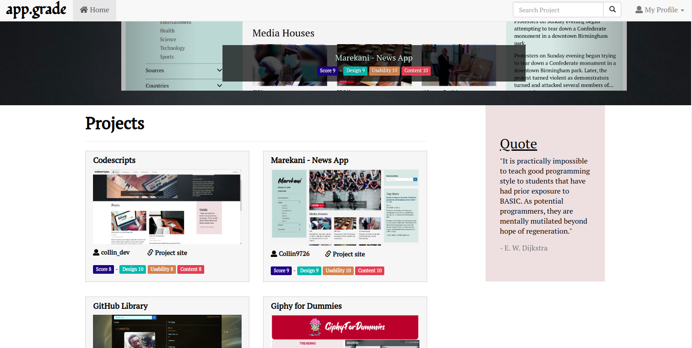

# app.grade
#### An app where developers post projects for reviews, 13/07/2020
#### By [Collin Owino](https://github.com/Collin9726)

### [app.grade app](https://appgradecdev.herokuapp.com/)

## Description

<table>
<tr>
<td>
<b>app.grade</b> is an app where developers can post their projects for reviewing. On the landing page one views a list of the projects posted. The top rated projects are featured on a carousel. One can also search for a specific project. To review or post a project a user has to log in to their account.
  
The project also offers API endpoints.
</td>
</tr>
</table> 

#### Latest updated version is on 13th July 2020.

## Technologies used

1. Python v3.6
2. Django 3.0.7
3. Django REST
4. Postgres
5. AWS S3 buckets
6. JavaScript
7. HTML & CSS

## Development

The app has been developed with Django 3.0.7. It uses django REST for API functionalities. It is hosted on Heroku cloud platform and makes use of PostgreSQL database for app data while AWS S3 buckets stores static and media files. The app uses dependencies as listed on `requirements.txt`. Testcases have been written for all model methods and API endpoints tested with Postman. It's source code is available on GitHub at https://github.com/Collin9726/app.grade

## API endpoints
- https://appgradecdev.herokuapp.com/api/profiles/
- https://appgradecdev.herokuapp.com/api/projects/

## Setup & Run instructions
- Clone the repo to your machine
- Create and activate a virtual environment
- Install the dependencies listed on `requirements.txt`.
- Include a `.env` file that provides `SECRET_KEY`, `AWS_ACCESS_KEY_ID`, `AWS_SECRET_ACCESS_KEY` among other environment variables as listed in `.env.sample`
- Run your app on `MODE='dev'` config for debugging purposes.

To contribute to this project on any modules, follow these easy steps:

- Fork the repo
- Create a new branch in your terminal (git checkout -b improve-feature)
- Make appropriate changes in file(s)
- Add the changes and commit them (git commit -am "Improve App")
- Push to the branch (git push origin improve-app)
- Create a Pull request

## Support and contact details
For any queries, issues, ideas or concerns contact [Collin Owino](owino.collin@gmail.com). Your feedback is highly appreciated. 
### [License](LICENSE)
MIT license
Copyright (c) 2020 **Collin Owino**